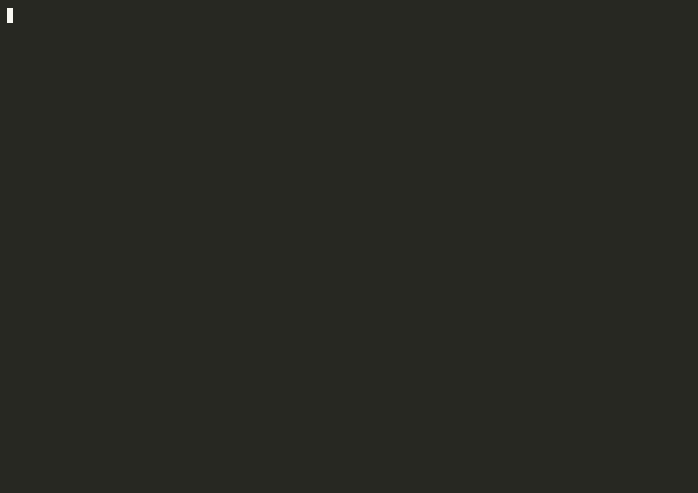

# force-close

[](https://github.com/softganz88/force-close/stargazers)
[](https://github.com/softganz88/force-close/releases/latest)

[](LICENSE)

Advanced X11 process recovery and deep-analysis tool — an interactive TUI for inspecting and force-terminating stuck windows/processes, plus a non-interactive CLI mode for killing by name pattern.



*Listing windows, selecting one, confirming, and watching the kill chain close it (the target here is a throwaway window spawned just for the demo).*

## Requirements

Linux + X11 (or XWayland). Depends on: `wmctrl`, `ps`, `lsof`, `pgrep`, `tput`, `awk`, `sed`, `sort`, `xargs`, `head` (all checked at startup).

> **X11-only:** native Wayland windows are invisible to `wmctrl` and will not appear. Run under an X11 session (or XWayland for X11 clients).

## Usage

```bash
./force-close.sh              # interactive TUI: list windows, terminate or analyze by id
./force-close.sh <pattern>    # CLI: confirm-and-kill every process matching <pattern>
```

**TUI keys:** `<id>` terminate · `a <id>` analyze · `r` refresh · `q` quit.

**Kill chain** (graceful → forced): X11 window close → subtree `SIGTERM` → subtree `SIGKILL`, each with a timeout and a re-validation of process identity before escalating. It signals the target's process **subtree** (the PID and its descendants), never its process group — on a desktop session GUI apps share the session leader's process group, so a group kill would take down the whole session.

## CLI exit codes

| Code | Meaning |
|------|---------|
| `0`  | all confirmed targets terminated (or nothing to do / declined) |
| `1`  | no matching processes |
| `2`  | at least one target could not be terminated |

## Safety

- Never lists or signals its own process tree (PID / ancestors / process group / session) — survives renaming the script.
- Anchors each target to its `/proc/<pid>/stat` start time, captured at listing time, to defeat PID reuse before sending any signal.
- Signals only the target's process subtree, never its process group, so killing a desktop app can't take down the shared session group.
- Refuses to terminate a session leader (a process whose PID equals its session id) — doing so would close every app in the session.
- Treats zombies as un-killable and reports that their parent must reap them, rather than looping on a kill that can never succeed.
- Sanitizes attacker-influenced window titles before printing.
- **tmux/screen caveat:** the self-tree exclusion is based on process session and ancestry. Run inside a multiplexer, the script lives in the tmux/screen server's session — so the terminal hosting your client is *not* excluded and appears in the list like any other window. Run the script directly in the terminal you want protected.

## Tests

The pure helpers (`to10`, `trunc_str`, `escape_pattern`, `get_starttime`, `is_self_tree`) and the EXIT-trap exit-code contract are covered by a [bats](https://github.com/bats-core/bats-core) suite:

```bash
bats tests/
```

The suite spawns only its own short-lived `sleep` processes — the kill chain itself is never exercised automatically.

## Changelog

### v5.0.4

- **Fix: no false "already terminated".** If a target exited in the brief window between the identity check and the kill chain, the confirm prompt read "0 processes" and a `y` reported success having signalled nothing; `terminate_group` now detects the empty subtree and reports "already gone". `collect_subtree` no longer counts a PID that has no `/proc` entry.
- **Fix: no spurious "FAILED" from PID reuse.** After the final `SIGKILL`, the survivor check now re-anchors on the root's start time first — a PID recycled by an unrelated process during the settle window is no longer mistaken for a surviving process tree and reported FAILED (exit 2).
- **Note:** documented that subtree termination reaches descendants only — a helper that detached via `setsid()` (e.g. a browser GPU process) is not signalled but self-exits when its IPC to the killed root breaks; the window is always in the root's subtree, so it still closes.

### v5.0.3

- **Fix (critical): no longer kills the whole desktop session.** The kill chain signalled the target's entire *process group* (`kill -- -PGID`). On Cinnamon/GNOME every GUI app shares the session leader's process group (e.g. `cinnamon-session`), so terminating any listed app SIGTERM'd all ~45 session processes and logged the user out. The chain now signals the process **subtree** (the PID and its descendant helpers/renderers) instead — a Chrome window kills Chrome and its renderers, not the session. A second guard refuses outright to terminate a session leader (`pid == sid`). The confirm prompt now names the app and its process-tree size rather than a process-group id.
- **PID-less windows are now listed** — windows whose app sets no `_NET_WM_PID` (old Xt toolkits such as `xmessage`, some Wine windows) were silently invisible. They now appear as muted close-only rows (`?` in the PID column, `no PID hint` in WCHAN) and can be closed via a WM close request by window id; analysis and signal escalation stay unavailable (there is no PID to act on), and the TUI says so.
- **Kill-chain results stay visible** — success and abort messages (`OK`, `Process group exited`, identity-changed aborts) paused for a beat before the table redraws; previously they flashed by unreadably on the graceful paths.
- **Analyze screen no longer wraps** — long `lsof` lines truncate to the terminal width.
- **Docs: tmux/screen caveat** — running inside a multiplexer puts the script in the server's session, so the self-tree exclusion no longer covers the terminal hosting your client (see Safety).

### v5.0.2

- **Fix: CLI exit codes** — in CLI mode every exit collapsed to `1` (a nonzero return from the `restore_term` EXIT trap overrode the real status under `set -e`), breaking the documented `0`/`2`/`130` codes. The trap is now infallible and only restores cursor/screen when the TUI actually started, which also keeps piped CLI output free of stray escape sequences.
- **Fix: identity anchor vs newline-in-comm** — a process with a newline in its comm (writable via `/proc/self/comm`) made `/proc/<pid>/stat` multi-line; the line-based read returned an empty start time, so the tool reported such processes as "already gone" and `kill_gate` skipped identity re-validation. `get_starttime` now reads the whole stat file.
- **Tests** — bats suite for the pure helpers (`tests/force-close.bats`, 24 cases); the inline pattern escaping was extracted into `escape_pattern()` to make it testable.

### v5.0.1

- **Terminal hygiene** — a `trap` restores the terminal on any exit (including `Ctrl-C`, `SIGTERM`, or an unexpected abort): leaves the alternate screen, restores the cursor, and clears pending color. The interactive TUI now runs on the alternate screen so it no longer clobbers scrollback; CLI mode stays linear and pipeable.
- **Selection-id normalization** — leading-zero and spaced inputs such as `a 03` and `a  3` now resolve correctly, with strict digit validation so malformed input can't abort the script.

### v5.0.0

- Initial reviewed release: identity-anchored kill chain (defeats PID reuse), group-aware liveness, self-tree exclusion, zombie handling, sanitized rendering, single-source table geometry, and a fork-free batched refresh. `shellcheck`-clean.

## License

[MIT](LICENSE) © softganz88
